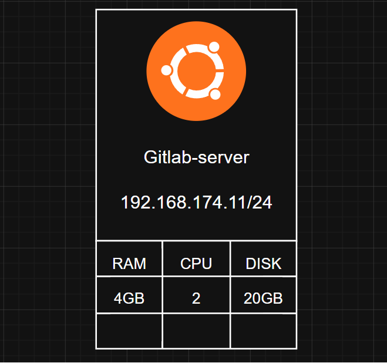
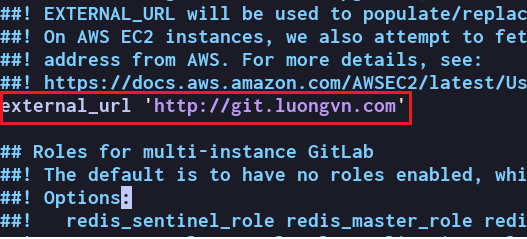
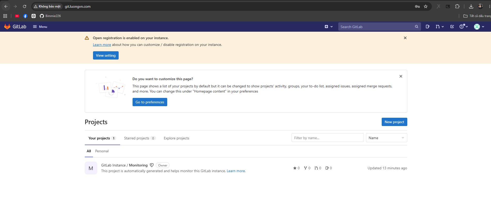
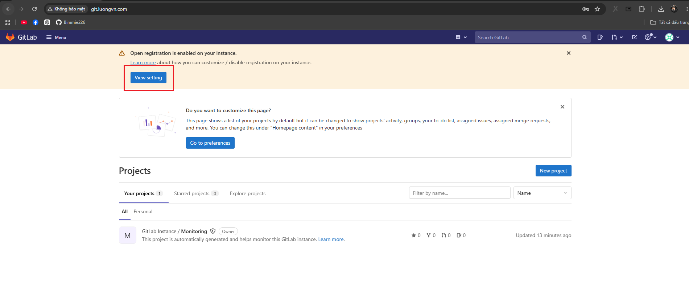
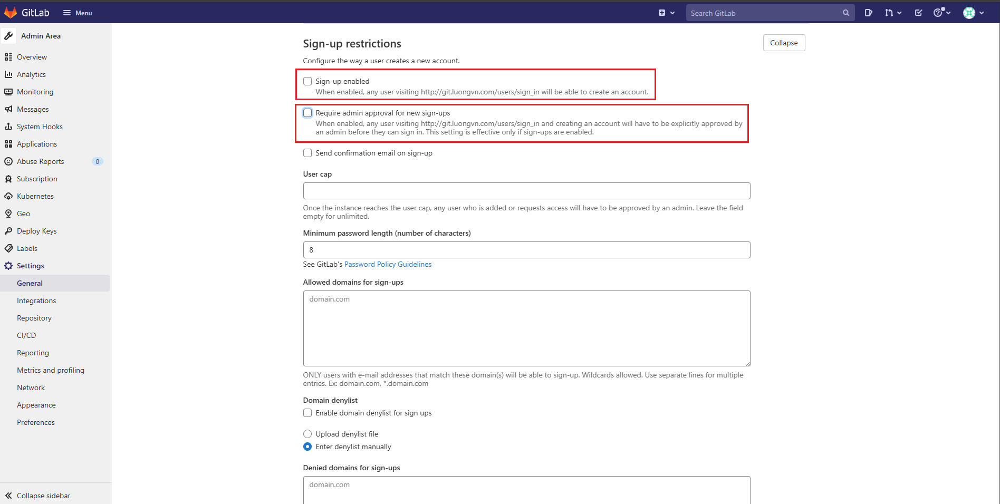
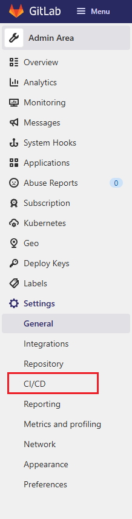
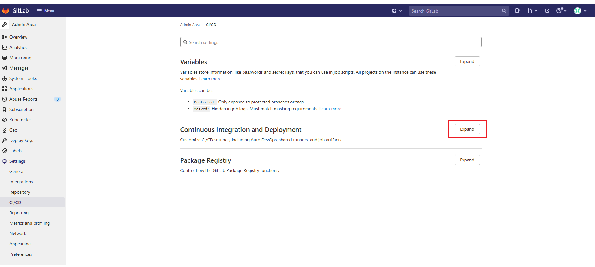
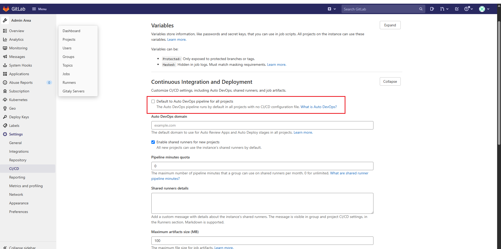

# Cài đặt Gitlab server 

## I. Các thông số của Server 

 

## II. Cài đặt 

### 2.0 Bước 1: Cài đặt package của gitlab 

Tùy thuộc vào phiên bản của distro bạn sử dụng cho server hãy tìm các version của gitlab tương thích với distro của bạn [tại đây](https://packages.gitlab.com/ui/browse/gitlab/gitlab-ee)

- Cài dependency: 

```bash
sudo apt update 
sudo apt install -y curl openssh-server ca-certificates tzdata
```

- Tải file `.deb` mà bạn đã chọn  

```bash
wget -O gitlab-ee_14.4.1-ee.0_amd64.deb \
"https://packages.gitlab.com/gitlab/gitlab-ee/ubuntu/focal/pool/main/g/gitlab-ee/gitlab-ee_14.4.1-ee.0_amd64.deb"
```

- Cài package: 

```bash
dpkg -i gitlab-ee_14.4.1-ee.0_arm64.deb
```

### 2.1 Bước 2: Config gitlab

```bash
vim /etc/gitlab/gitlab.rb
```

- Tìm phần EXTERNAL_URL sau đó sửa thành URL của bạn: 

 

- Tiến hành addhost trên server với URL là URL của gitlab bạn đã chọn và IP là IP của server của bạn

```bash
vim /etc/hosts
```

```bash
192.168.174.11 git.luongvn.com
```

- Reconfig gitlab: 

```bash
sudo gitlab-ctl reconfigure
```


### 2.2 Bước 3: Truy cập ở browser

- Addhost và tiến hành truy cập trên browser của bạn sau đó đăng nhập với `user:root` vs `password` bạn sẽ lấy trong file `/etc/gitlab/initial_root_password`: 

```bash
root@gitlab-server:~# cat /etc/gitlab/initial_root_password
# WARNING: This value is valid only in the following conditions
#          1. If provided manually (either via `GITLAB_ROOT_PASSWORD` environment variable or via `gitlab_rails['initial_root_password']` setting in `gitlab.rb`, it was provided before database was seeded for the first time (usually, the first reconfigure run).
#          2. Password hasn't been changed manually, either via UI or via command line.
#
#          If the password shown here doesn't work, you must reset the admin password following https://docs.gitlab.com/ee/security/reset_user_password.html#reset-your-root-password.

Password: WUdxuuAKnHMJCRpq0m4BXME2uxI5zxA0FWtu2Yu5dEQ=

# NOTE: This file will be automatically deleted in the first reconfigure run after 24 hours.
```


 


### 2.3 Bước 4: Disable tạo mới user trong gitlab

- Chọn `view settings`: 


 


- Bỏ tích các ô `Sign-up enabled` vs `Require admin approval for new sign-ups`: 


 


### 2.4 Bước 5: Cấu hình gitlab cơ bản

- Chọn tab CI/CD: 


 


- Chọn `expand` trong `Continuous Integration and Deployment`: 


 

- Bỏ tích option `Default to Auto DevOps pipeline for all projects`: 


 


