# Triển khai git workflow 

## I. Phân hoạch địa chỉ IP 

## II. Triển khai 

### 2.0 Tạo Project trên gitlab 

- Tạo Group: 

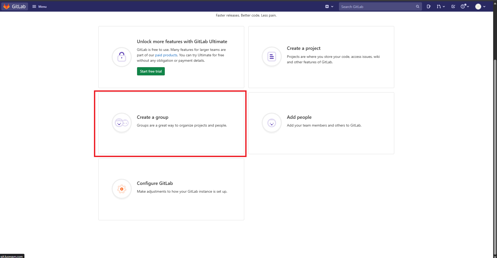 

- Đặt tên cho group: 


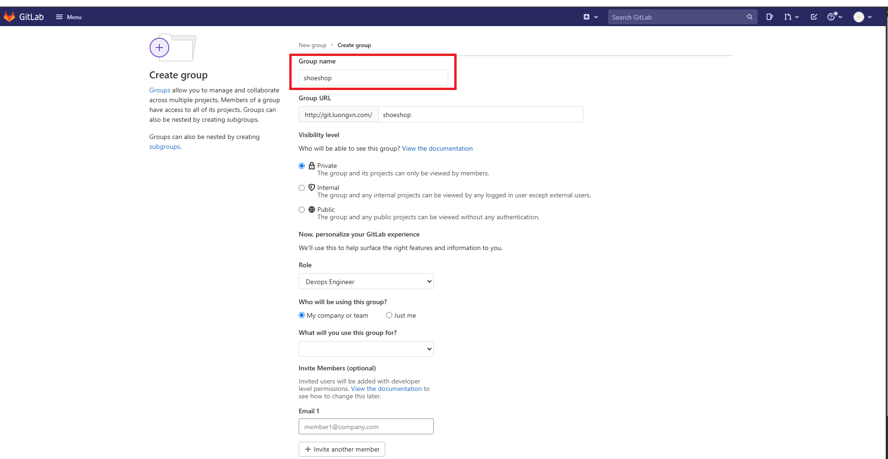 

- Tạo New Project `shoeshop` trong group `shoeshop`: 


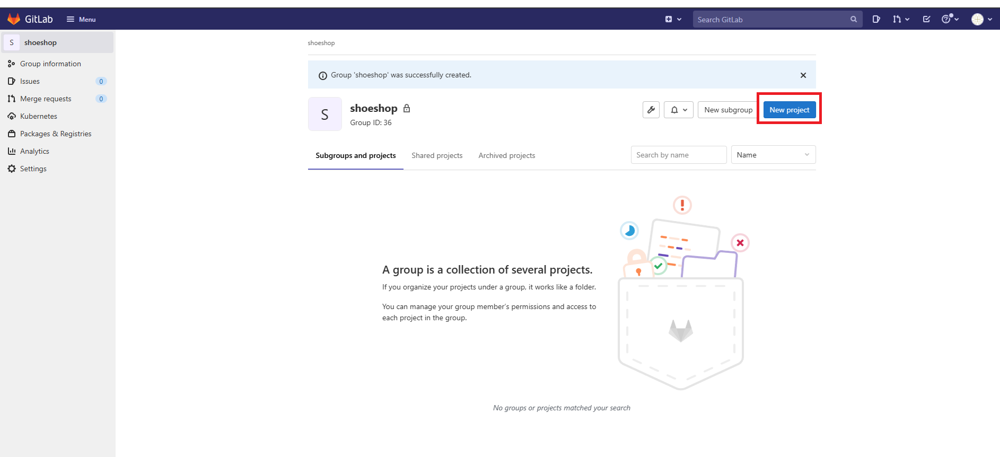 


- Đặt tên cho Project: 


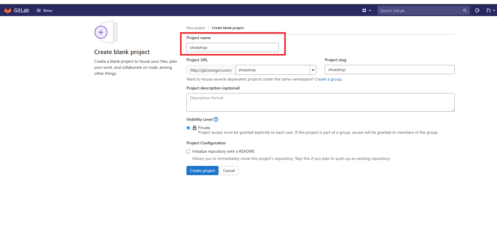 

### 2.1 Đẩy code từ server `Rocky-server` lên repo Shoeshop: 

```bash
mkdir /data
cd /data
git config --global user.name "Vu Ngoc Luong"
git config --global user.email "luongvn@bim.tech"
git clone http://git.luongvn.com/shoeshop/shoeshop.git
cd shoeshop
```

- Ta sẽ đẩy source code mẫu của shoeshop vào thư mục `/data/shoeshop` sau đó push lên git server, bạn có thể lấy source code mẫu [tại đây](https://github.com/Bimmie226/spOveD/blob/main/demo%20projects/shoeshop-ecommerce.zip)

```bash
cp -rf shoeshop/* /data/shoeshop/
```

```bash
[root@Rocky-server luongvn]# cd /data/shoeshop/
[root@Rocky-server shoeshop]# ll
total 2600
-rw-r--r-- 1 root root    3060 Aug 13 22:51 pom.xml
-rw-r--r-- 1 root root     616 Aug 13 22:51 README.md
-rw-r--r-- 1 root root 2650849 Aug 13 22:51 shoe_shopdb.sql
drwxr-xr-x 4 root root      30 Aug 13 22:52 src
```

- Push code: 

```bash
git add . 
git commit -m "feat(project): create base project"
git push --set-upstream origin main 
```


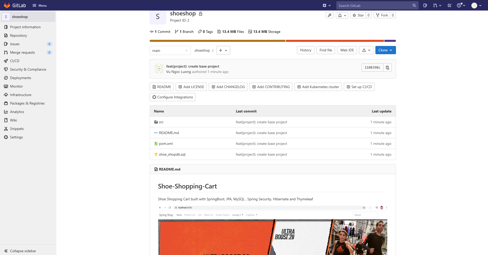

### 2.2 Tạo branch theo chuẩn git workflow 

- Tạo nhánh: 

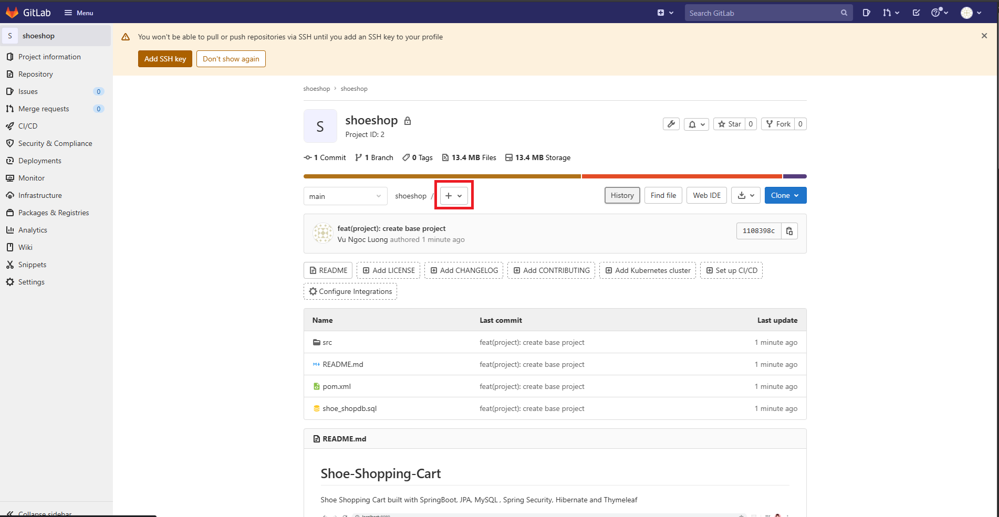

- Tạo nhánh develop: 


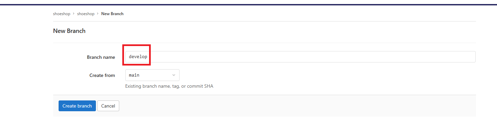

- Từ develop tiếp tục tạo các nhánh feature, ở đây tôi sẽ tạo thêm nhánh `feature/frontend/login` từ nhánh `develop`

### 2.3 Tiến hành thực hiện git workflow

- Tạo user mới cho prj đặt tên là `dev1`: 


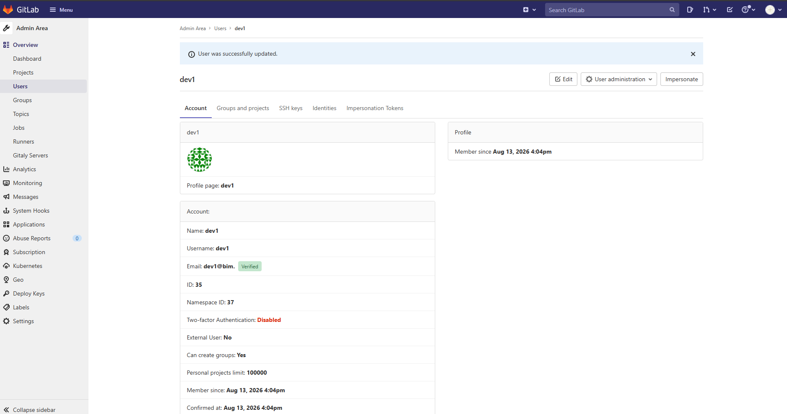

- Add dev1 vào prj: 


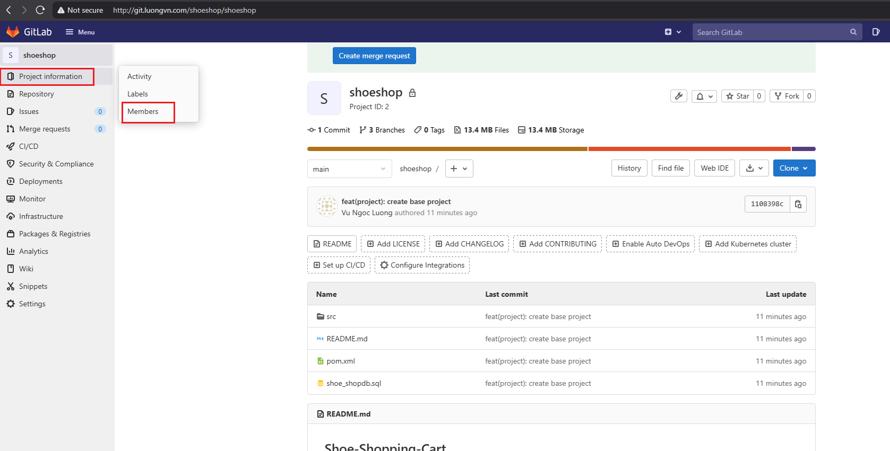

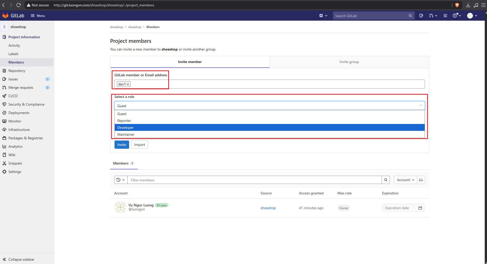

    - `role`: nếu là devops hãy để tối thiểu là `maintainer` để có thể có quyền truy cập vào setting để cấu hình dự án, còn ở đây là 1 bạn dev nên sẽ để là developer

### 2.4 Setting merge request 


- Chọn `settings` -> `repository`


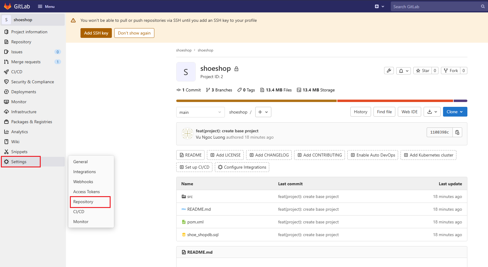

- Setting protect branch: 


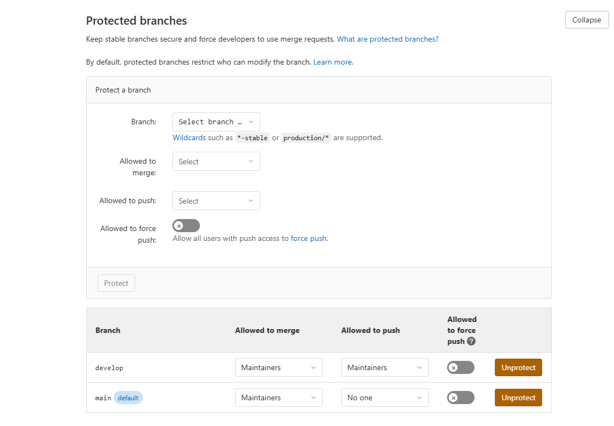
