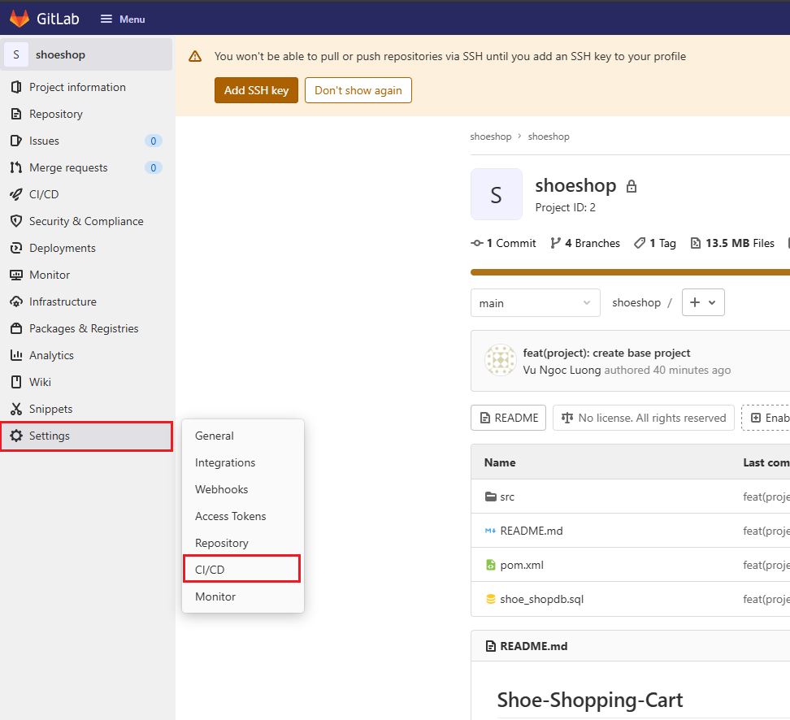

# Gitlab CI/CD (Continuous Deployment) 

## I. Phân hoạch địa chỉ IP 

## II. Cấu hình

### 2.0 Cài đặt gitlab-runner trên các con server cần triển khai dự án trên đó 

- Cài gitlab-runner trên Rocky 9: 

```bash
curl -L "https://packages.gitlab.com/install/repositories/runner/gitlab-runner/script.rpm.sh" | sudo bash
export GITLAB_RUNNER_DISABLE_SKEL=true
sudo -E dnf install gitlab-runner -y
```

- Kiểm tra: 

```bash
[root@Rocky-server shoeshop]# sudo systemctl status gitlab-runner
● gitlab-runner.service - GitLab Runner
     Loaded: loaded (/etc/systemd/system/gitlab-runner.service; enabled; preset: disabled)
     Active: active (running) since Thu 2026-08-13 23:33:00 +07; 9s ago
   Main PID: 55551 (gitlab-runner)
      Tasks: 8 (limit: 10843)
     Memory: 18.4M (peak: 18.9M)
        CPU: 60ms
     CGroup: /system.slice/gitlab-runner.service
             └─55551 /usr/bin/gitlab-runner run --config /etc/gitlab-runner/config.toml --working-directory /home/gitlab-runner --service gitlab-runner --user gitlab-runner

Aug 13 23:33:00 Rocky-server gitlab-runner[55551]: Runtime platform                                    arch=amd64 os=linux pid=55551 revision=343288f1 version=19.2.2
Aug 13 23:33:00 Rocky-server gitlab-runner[55551]: Starting multi-runner from /etc/gitlab-runner/config.toml...  builds=0 max_builds=0
Aug 13 23:33:00 Rocky-server gitlab-runner[55551]: Running in system-mode.
Aug 13 23:33:00 Rocky-server gitlab-runner[55551]:
Aug 13 23:33:00 Rocky-server gitlab-runner[55551]: Created missing unique system ID                    system_id=s_45ec4c31fb20
Aug 13 23:33:00 Rocky-server gitlab-runner[55551]: Usage logger disabled                               builds=0 max_builds=1
Aug 13 23:33:00 Rocky-server gitlab-runner[55551]: Configuration loaded                                builds=0 max_builds=1
Aug 13 23:33:00 Rocky-server gitlab-runner[55551]: listen_address not defined, metrics & debug endpoints disabled  builds=0 max_builds=1
Aug 13 23:33:00 Rocky-server gitlab-runner[55551]: [session_server].listen_address not defined, session endpoints disabled  builds=0 max_builds=1
Aug 13 23:33:00 Rocky-server gitlab-runner[55551]: Initializing executor providers                     builds=0 max_builds=1
```

```bash
[root@Rocky-server shoeshop]# gitlab-runner -v
Version:      19.2.2
Git revision: 343288f1
Git branch:   19-2-stable
GO version:   go1.26.4
Built:        2026-08-12T15:19:39Z
OS/Arch:      linux/amd64
```

### 2.1 Kết nối gitlab-runner với dự án 

- Chọn `setting` -> `CI/CD`, sau đó chọn Runner để lấy URL vs Token 

 

- Trên Rocky server nhập: 

```bash
gitlab-runner register
```

- Hãy điền thông tin vs option như sau: 

```bash
[root@Rocky-server shoeshop]# gitlab-runner register
Runtime platform                                    arch=amd64 os=linux pid=55686 revision=343288f1 version=19.2.2
Running in system-mode.

Enter the GitLab instance URL (for example, https://gitlab.com/):
http://git.luongvn.com/
Enter the registration token:
W_u9N8mhyH74Z_47fqoo
Enter a description for the runner:
[Rocky-server]: Rocky-server
Enter tags for the runner (comma-separated):
Rocky-server
Enter optional maintenance note for the runner:

WARNING: Support for registration tokens and runner parameters in the 'register' command has been deprecated in GitLab Runner 15.6 and will be replaced with support for authentication tokens. For more information, see https://docs.gitlab.com/ci/runners/new_creation_workflow/
Registering runner... succeeded                     correlation_id=01KZY016ZDMGW5479SVNC47X6E runner=W_u9N8mhy runner_name=Rocky-server
Enter an executor: docker-windows, docker-autoscaler, docker+machine, custom, instance, kubernetes, ssh, parallels, virtualbox, shell, docker:
shell
Runner registered successfully. Feel free to start it, but if it's running already the config should be automatically reloaded!

Configuration (with the authentication token) was saved in "/etc/gitlab-runner/config.toml"
```

- Run gitlab-runner: 

```bash
[root@Rocky-server shoeshop]# nohup gitlab-runner run --working-directory /home/gitlab-runner/ --config /etc/gitlab-runner/config.toml --service gitlab-runner --user gitlab-runner 2>&1 &
```

### 2.2 Example config CICD 

```yaml
variables: 
    projectname: shoe-ShoppingCart
    version: 0.0.1-SNAPSHOT
    projectuser: shoeshop
    projectpath: /datas/shoeshop

stages: 
    - build
    - deploy
    - checklog 

build: 
    stage: build
    variables: 
        GIT_STRATEGY: clone 
    script: 
        - mvn install -DskipTests=true
    tags: 
        - Rocky-server

deploy: 
    stage: deploy
    variables: 
        GIT_STRATEGY: none
    script: 
        - sudo cp target/$projectname-$version.jar $projectpath
        - sudo chown -R $projectuser. $projectpath
        - sudo su $projectuser -c "kill -9 $(ps -ef | grep $projectname-$version.jar | grep -v grep | awk '{print $2}')"
        - sudo su $projectuser -c "cd $projectpath/; nohup java -jar $projectname-$version.jar > nohup.out 2>&1 &"
    tags: 
        - Rocky-server
```
