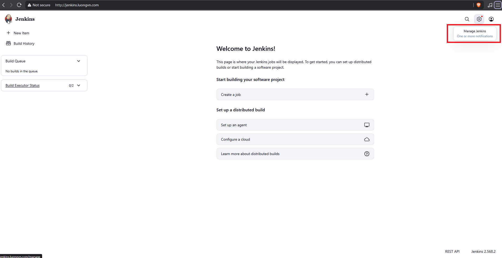
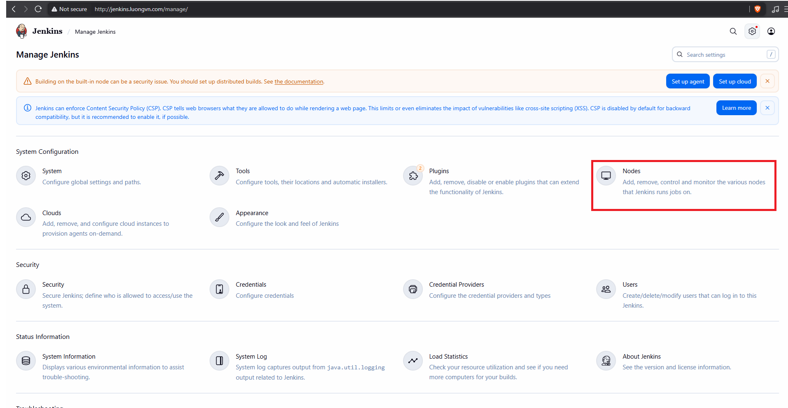
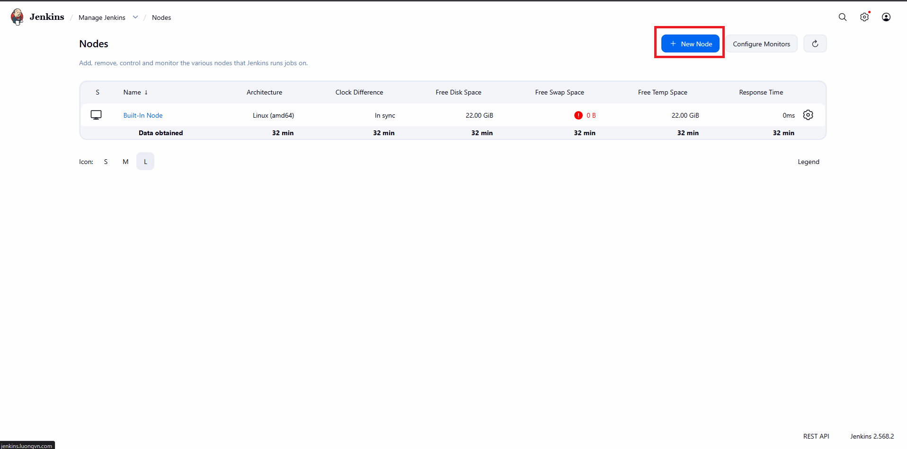
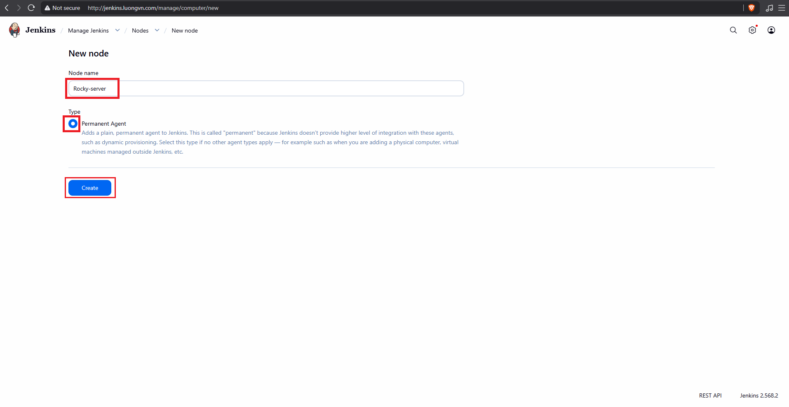

# Jenkins CI/CD (Continuous Deployment) 

Trên bất kì server nào muốn triển khai dự án đều phải cài đặt jenkins agent -> trên các server sẽ đều phải có java (version tương ứng trên jenkins server)

## I. Cài đặt Jenkins agent 

### 1.0 Check version của java trên jenkins server 

- Trên jenkins server: 

```bash
root@jenkins-server:~# java -version
openjdk version "21.0.11" 2026-04-21
OpenJDK Runtime Environment (build 21.0.11+10-1-22.04.2-Ubuntu)
OpenJDK 64-Bit Server VM (build 21.0.11+10-1-22.04.2-Ubuntu, mixed mode, sharing)
```

### 1.1 Cài đặt java trên Rocky-server

```bash
sudo dnf install java-21-openjdk java-21-openjdk-devel -y
```

### 1.2 Tạo user jenkins trên Rocky-server

```bash
adduser jenkins
passwd jenkins
```

### 1.3 Tạo node mới trên jenkins 

Bao nhiêu server triển khai dự án thì sẽ tạo bấy nhiêu ở bước này

- Chọn `Manage Jenkins`: 



- Chọn `Nodes`: 



- Chọn `New Node`: 




- Đặt tên cho Node, chọn vào `Permanent Agent` sau đó nhấp vào `create`: 

