# Cài đặt Gitlab
## Chuẩn bị
1 máy ubuntu để làm gitlab-server


## Thực hiện
### Bước 1: Cài đặt gitlab-ee package

Tải gitlab-ê package [tại đây](https://packages.gitlab.com/gitlab/gitlab-ee)

Ở đây, ta chọn phiên bản sau:

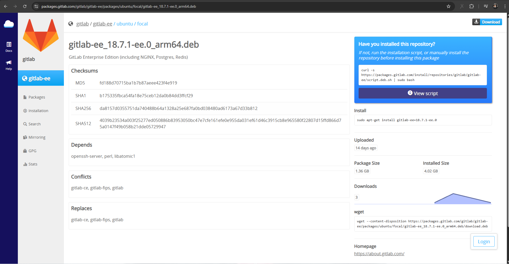

```bash
curl -s https://packages.gitlab.com/install/repositories/gitlab/gitlab-ee/script.deb.sh | sudo bash
```

```bash
sudo apt-get install gitlab-ee=18.7.1-ee.0
```

### Bước 2: add host cho gitlab

```bash
vi /etc/hosts
```

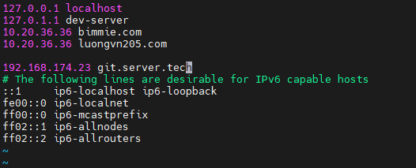

### Bước 3: Sửa URL của gitlab

Mở file cấu hình gitlab

```bash
vi /etc/gitlab/gitlab.rb
```

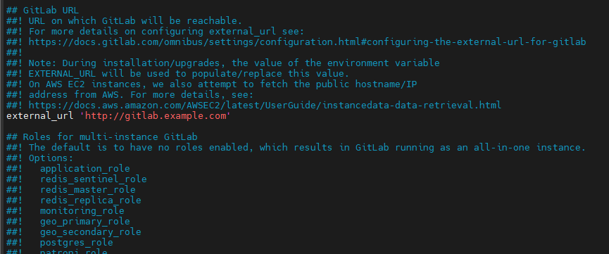

Sửa thành tên mà bạn điều chỉnh trong `/etc/hosts` ở đây là: `git.server.tech`

Sau đó chạy câu lệnh sau để áp dụng

```bash
gitlab-ctl reconfigure
```

### Bước 3: add host trên window

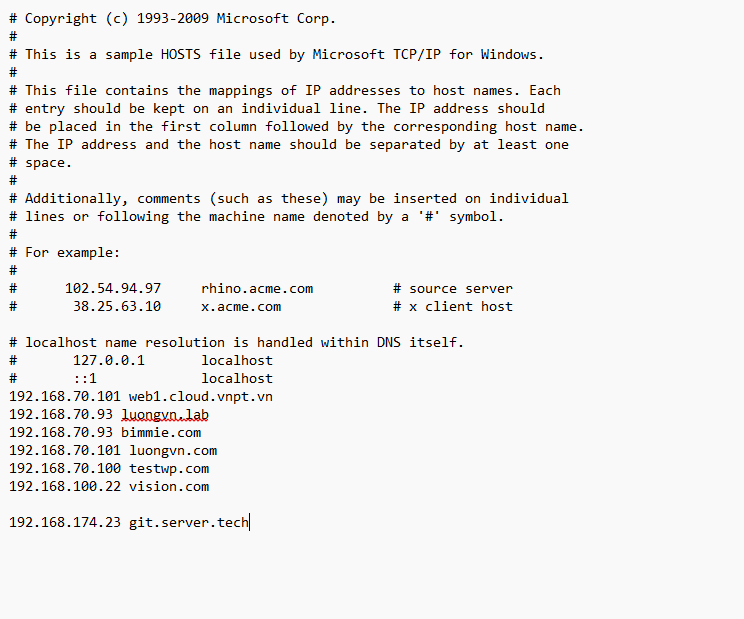

### Bước 4: Truy cập trên browser

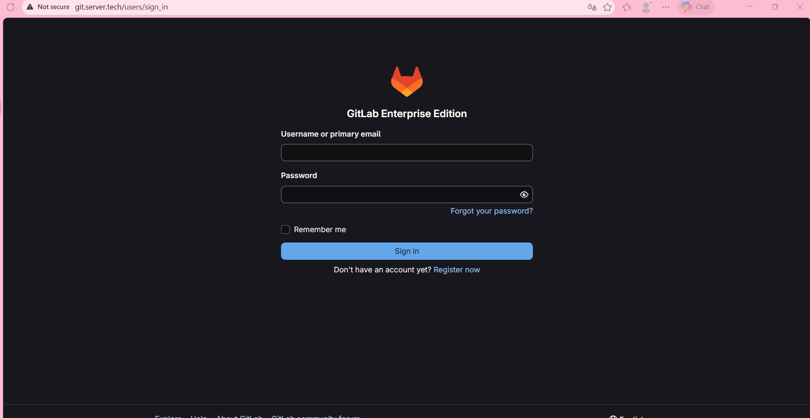

tài khoản mặc định sẽ là `root`

mật khẩu sẽ nằm trong `/etc/gitlab/initial_root_password`

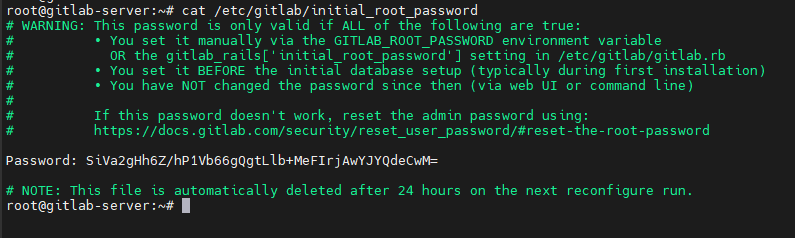

Ta copy và đăng nhập trên browser:

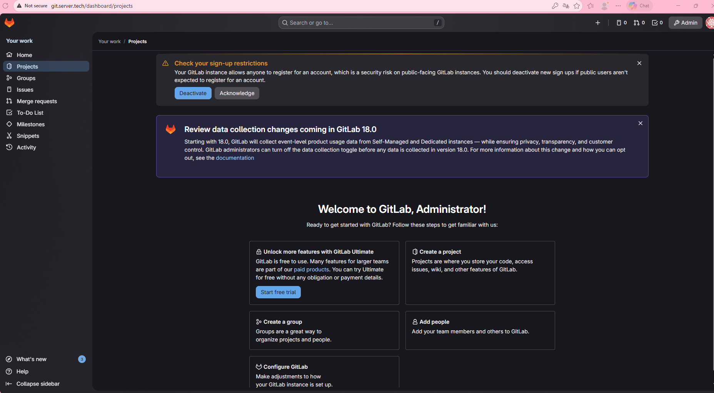

### Bước 5: Tắt tính năng tạo mởi User

Khi cần tạo 1 tk root thì chính chúng ta sẽ tạo chứ không phải user tạo

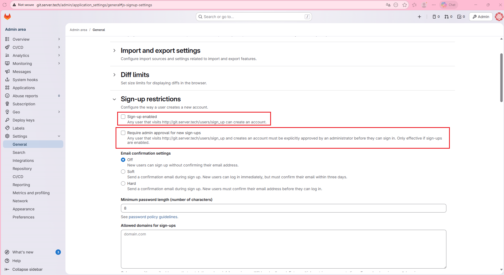

Sau đó nhấp vào `save change`

### Bước 6: Tắt Default auto devops

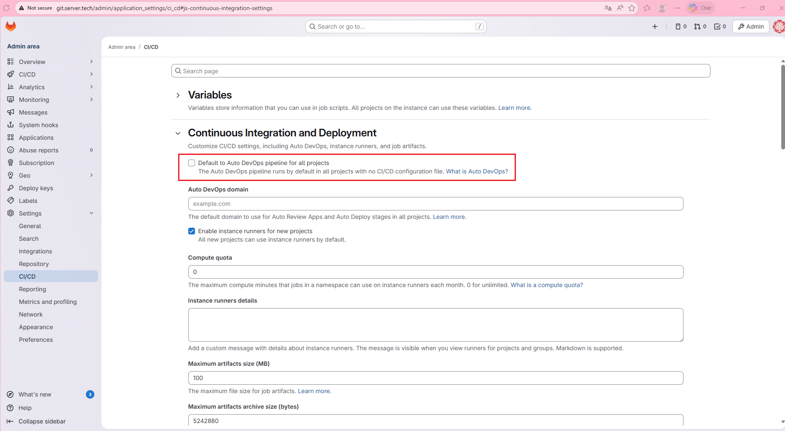

### Bước 6: Đổi mk user root

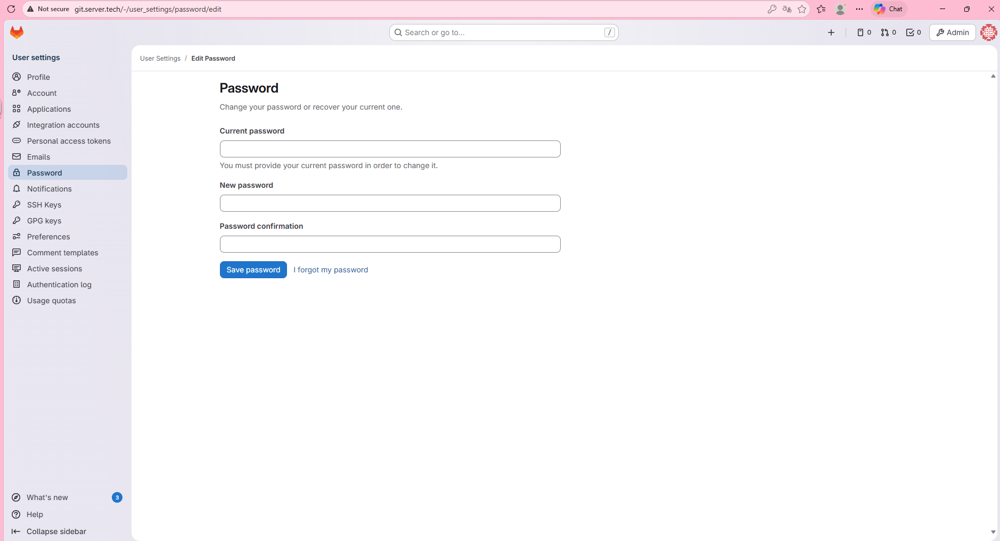

### Bước 7: Site Admin

Ở đây, ta có thể tạo 1 user mới:

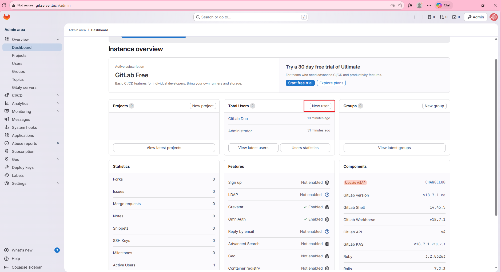

Nhập thông tin:

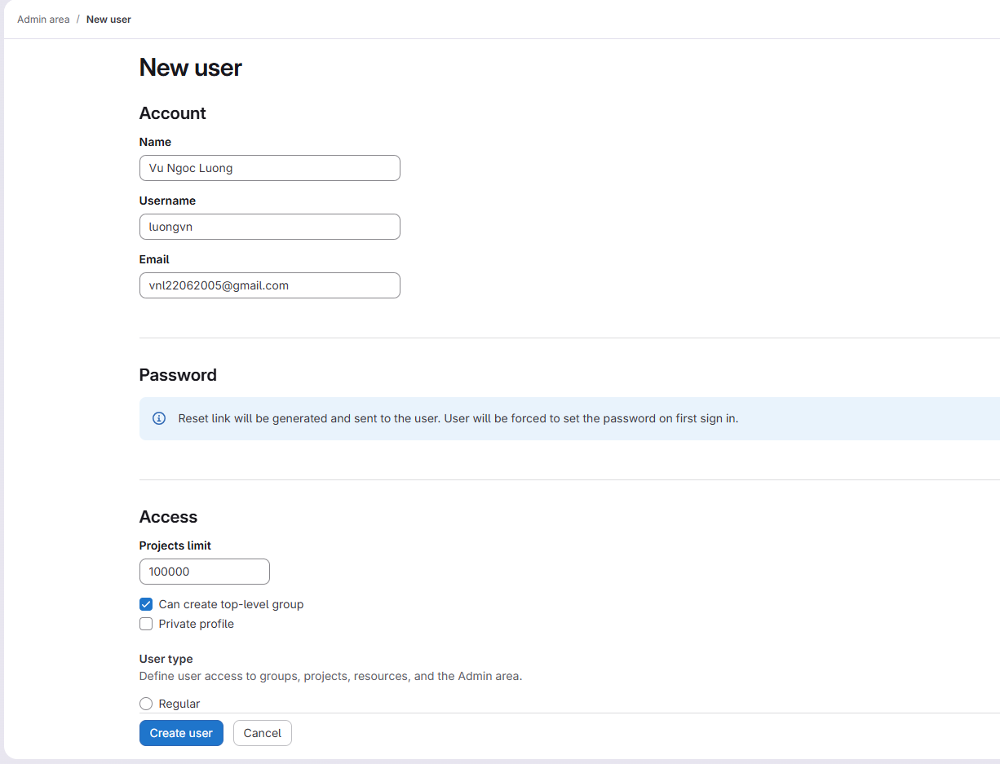

Muốn set quyền cho user này ta chọn ở phần `User type`:

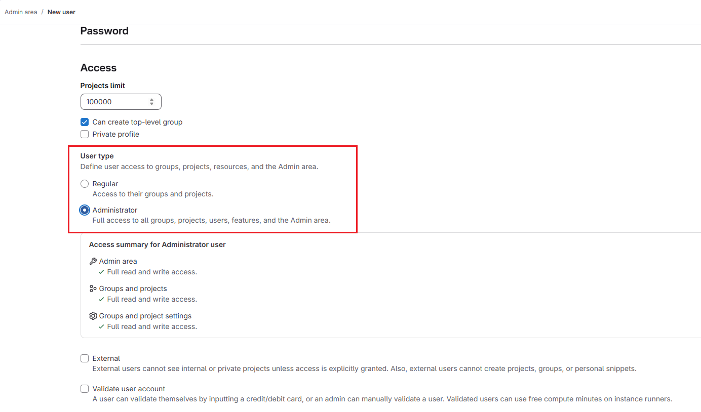

Nhấp vào `create user` sau đó chọn `edit` để tạo mk cho user này:

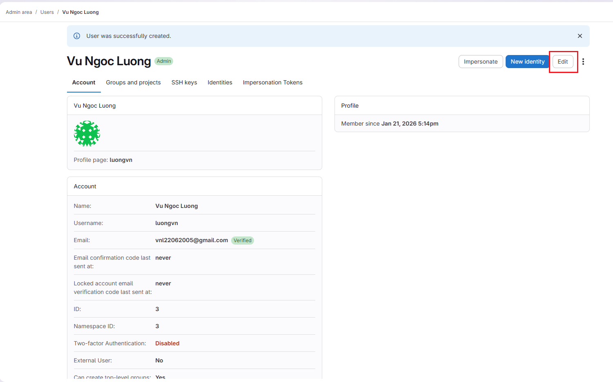

