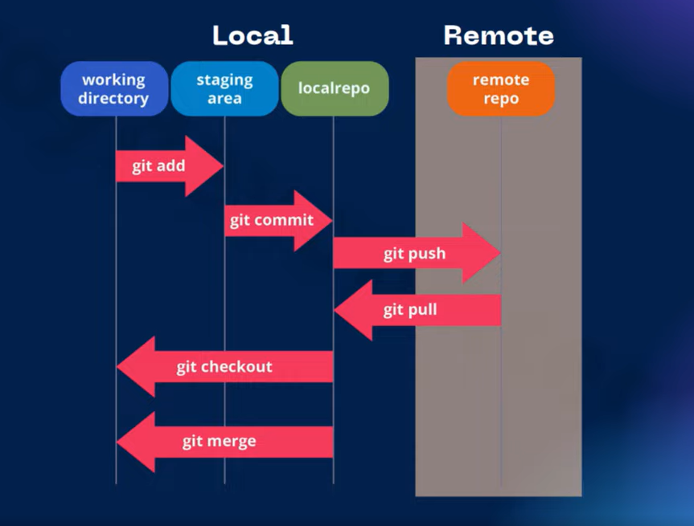

# Tìm hiểu về Git
## Ví dụ đặc trưng
Bạn đang làm việc nhóm và thuyết trình về 1 dự án nào đó, mọi người làm việc ở cùng 1 thư mục trên gg driver và các thành viên trong nhóm đều có thể chỉnh sửa hoặc đóng góp ý kiến.

Lúc đó chính xác gg driver được gọi là 1 **Git server**

## Git server & Git local
Như ở ví dụ trên thì trong thư mục làm việc chung sẽ có 3 bản chính:

- Bản thứ nhất là bản mà mọi người có ý kiến sẽ được đóng góp trên đó
- Bản thứ hai là bản được tổng hợp ý kiến từ bản thứ nhất và được chỉnh sửa để có thể thuyết trình nội bộ trong nhóm
- Bản thứ ba là bản mà mọi người thống nhất nội dung từ bản thứ 2 và mọi người sẵn sàng thuyết trình chính thức 

Vậy đó chính là **Git server** và các mội trường thông dụng của Git

Những tài liệu trên máy của bạn mà bạn chưa đưa lên thư mục driver đó thì gọi là **Git Local**

Vậy ta sẽ có 3 môi trường:

- **Phát triển**: Môi trường cho dev(mọi người cùng đóng góp ý kiến)
- **Kiểm thử**: Tester sẽ test các chức năng
- **Production**: Nội dung chứa ở phiên bản này đã sẵn sàng cho người dùng cuối cùng

Sử dụng Git sẽ có tác dụng là:
- Nhiều người phát triển
- Theo dõi thay đổi
- Kiểm soát truy cập
- Quản lý phiên bản
- Sao lưu và phục hồi

Vậy Git là 1 hệ thống quản lý phiên bản máy nguồn; nó cho phép các nhà phát triển theo dõi, ghi chép và quản lý lịch sử các thay đổi trong mã nguồn của dự án phần mềm

## Git architecture

Như ta đã biết, git có 2 phần chính là:
- Git local: chứa code mọi người ở máy tính cá nhân
- Git remote(server): Chứa code mọi người ở 1 nơi tập trung

