# Triển khai dự án Java Springboot & MySQL

## Bản demo của project
Các bạn có thể tải và xem chi tiết project [tại đây](https://github.com/Bimmie226/spOveD-/blob/main/demo%20projects/shoeshop-ecommerce.zip)

## Thực hiện 
Tải dự án lên server:

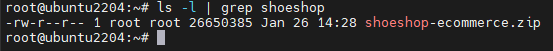

Giải nến project bằng `unzip`

```bash
unzip shoeshop-ecommerce.zip
```

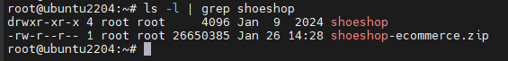

Chuyển `shoeshop` đến `/projects`

```bash
mv shoeshop /projects
```

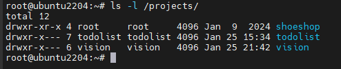

Ta tạo user riêng cho dự án:

```bash
adduser shoeshop
```

Thay đổi chủ sở hữu và quyền truy cập của `/projects/shoeshop`:

```bash
chown -R shoeshop:shoeshop /projects/shoeshop/
chmod -R 750 /projects/shoeshop/
```

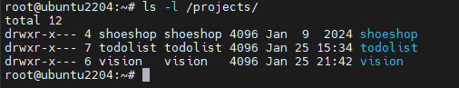

Như ta đã biết để triển khai dự án cần 2 bước chính là: `build` và `run`. Ta có thể research cách build dự án `java spring boot`. Ở đây mình tìm được tài liệu và bạn có thể tham khảo [tại đây](https://github.com/spring-attic/gs-maven?tab=readme-ov-file)

Chúng ta sẽ cần `java` và `maven` và cần chú ý file `pom.xml` là file lưu các version của dự án 

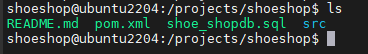

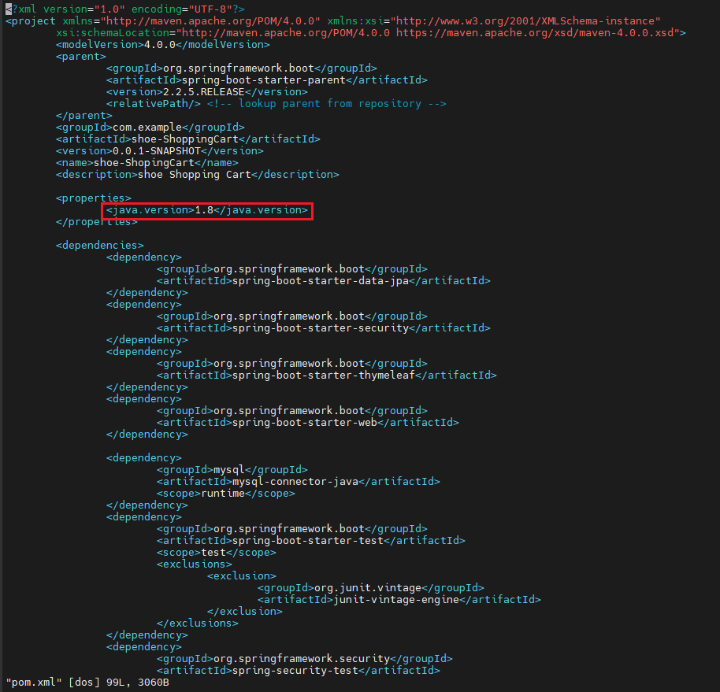

Như vậy ta sẽ cần cài `java` và `maven` trên server với version phù hợp mà ta đã biết ở file `pom.xml`. Ở đây ta sẽ cài `java17`:

```bash
apt install openjdk-17-jdk openjdk-17-jre
```

Cài đặt `maven`:

```bash
apt update
apt install maven
```

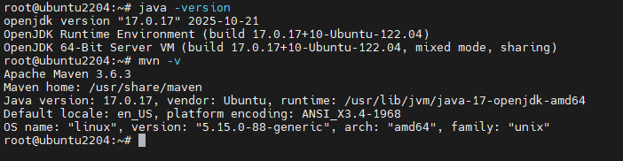

Vì trong dự án có database nên ta sẽ cần cài database hoặc có 1 server riêng cho database. Ở trong bài viết này vì không có nhiều tài nguyên nên mình sẽ cấu hình database trên ngay server lưu project

Những file cấu hình sẽ có cả cấu hình port và cấu hình database. Ta sẽ research file config database trong dự án spring boot ở đâu. Các bạn có thể tham khảo bài viết mình tìm được [tại đây](https://www.baeldung.com/spring-boot-configure-data-source-programmatic)

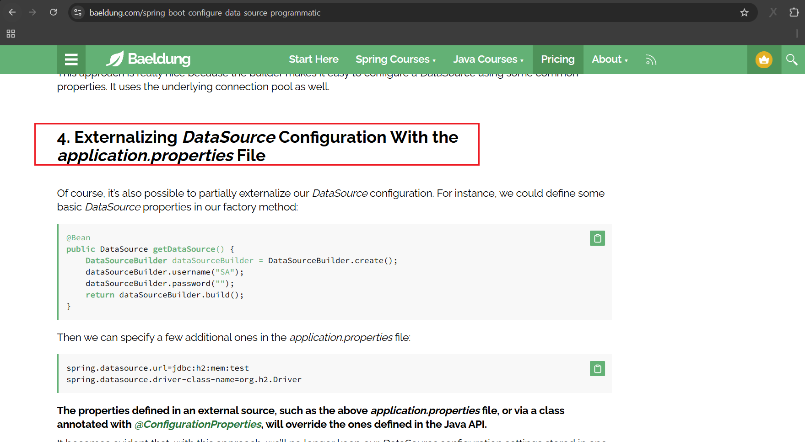

Ta có thể thầy file cấu hình là: `aplication.properties`

Ta sẽ tìm file này trên server: `src/main/resources/aplication.properties`

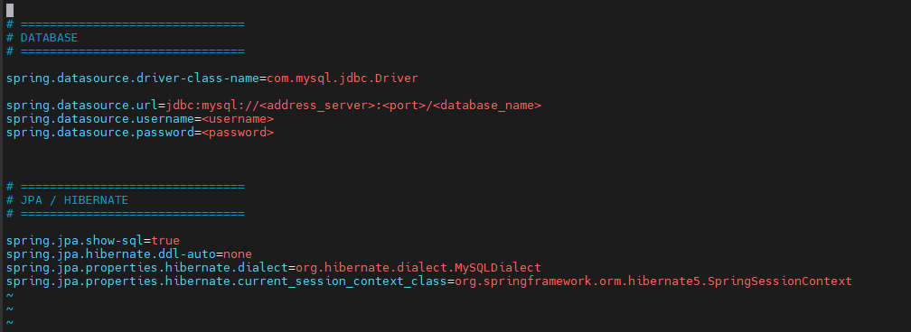

Các bạn có thể tham khảo cách cài đặt `MySQL` [Tại đây](https://github.com/Bimmie226/system-intership/blob/main/LuongVN/SQL/docs/Install_MySQL_on_Ubuntu.md)

Trong bài lab này, để đơn giản và thuận tiện ta sẽ cấu hình cho truy cập vào database từ mọi nơi:

```bash
vi /etc/mysql/mysql.conf.d/mysqld.cnf
```

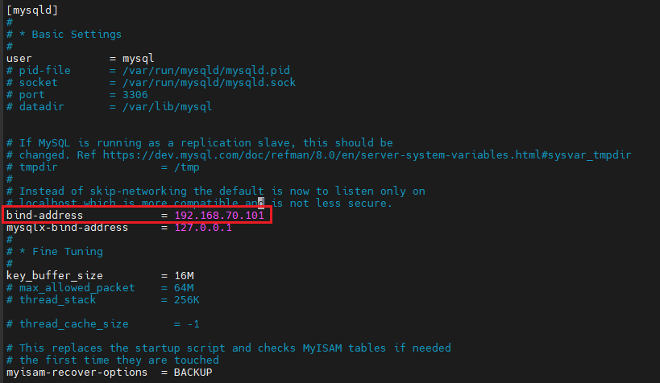

Ta sửa trường `bind-address` thành `0.0.0.0`

Khởi động lại mysql:

```bash
systemctl restart mysql.service
```

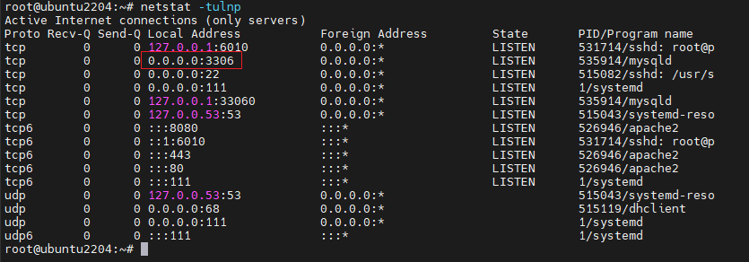

Ta để ý trong dự án có file database là: `shoe_shopdb.sql`

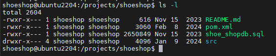

Bây giờ ta sẽ thêm file sql này vào Database:

Truy cập vào db:

```bash
mysql -u root -p
```

Tạo database `shoeshop`:

```sql
create database shoeshop;
```

Tạo user tương ứng cho database `shoeshop`:

```sql
create user 'shoeshop'@'%' identified by 'Shoeshop@2026';
```

Gán quyền cho user `shoeshop`:

```sql
grant all privileges on shoeshop.* to 'shoeshop'@'%';
flush privileges;
```

Ta sẽ thử truy cập bằng user `shoeshop`:

```bash
mysql -h 192.168.70.101 -P 3306 -u shoeshop -p
```

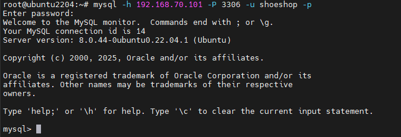

Kiểm tra các database của user `shoeshop`:

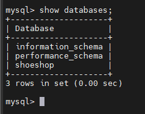

Bây giờ ta sẽ import file `shoe_shopdb.sql` vào database `shoeshop`:

```sql
use shoeshop;
```

```sql
source /projects/shoeshop/shoe_shopdb.sql;
```

Kiểm tra:

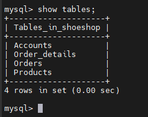

Tiếp theo ta sẽ sửa file cấu hình database `aplication.properties` trong dự án:

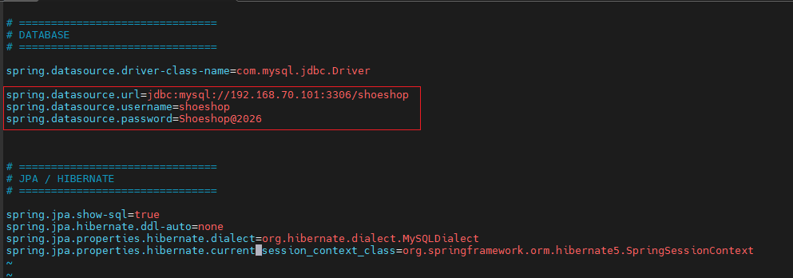

Bây giờ ta sẽ build dự án theo [doc](https://github.com/spring-attic/gs-maven?tab=readme-ov-file)

```bash
mvn install -DskipTests=true
```

- `-DskipTests=true`: Bỏ qua quá trình test trực tiếp của tool maven (chưa cần thiết)

Sau khi build thành công ta sẽ thấy trong dự án xuất hiện 1 thư mục `target`:

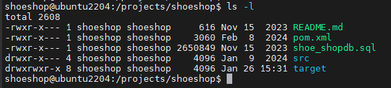

Ta kiểm tra xem thư mục này có những file gì:

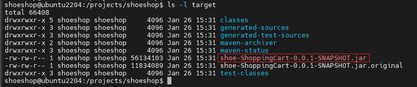

Ta thấy ở đây có file `.jar`, tiếp theo với hướng dẫn trên docs ta sẽ chạy lệnh 

```bash
java -jar target/shoe-ShoppingCart-0.0.1-SNAPSHOT.jar
```

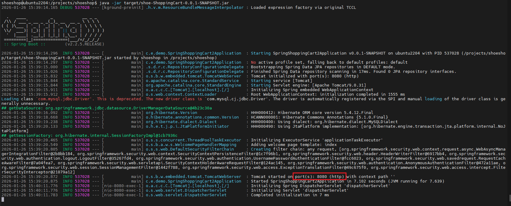

Như vậy dự án đã chạy thành công với `port 8080`. Bây giờ, trên browser ta thử truy cập: `192.168.70.101:8080`


Truy cập thành công, ta sẽ thử login:

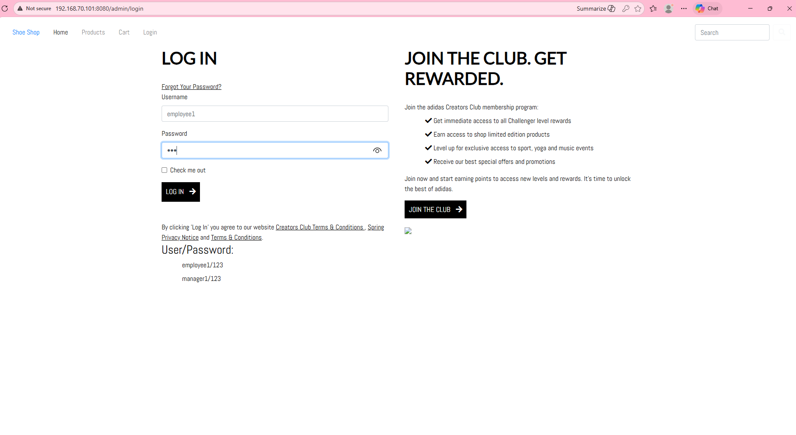

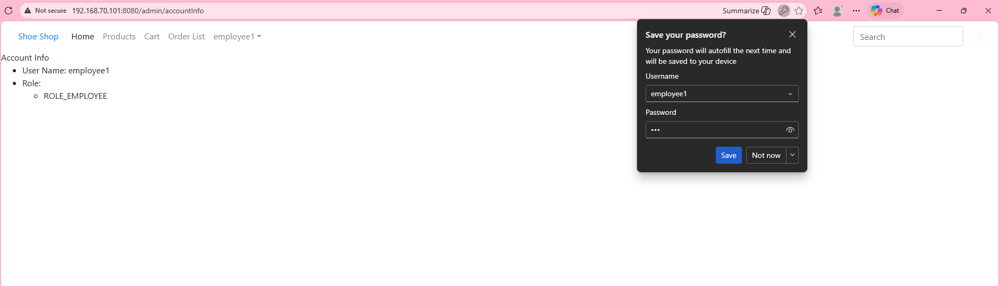

Như vậy, database của chúng ta đã hoạt động đúng và lúc này trên server cũng đã hiện log mới khi ta login vào:

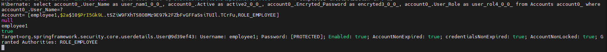

Tuy nhiên, lúc này ta có thể thấy ta đang chạy trên nền của server và ta không thể nào gõ câu lệnh nào để thao tác được nữa, bây giờ tôi muốn chạy ngầm kết hợp lưu log ra bên ngoài, do vậy tôi sẽ chạy câu lệnh sau:

```bash
# (CTRL + C để dừng tiến trình)
nohup java -jar target/shoe-ShoppingCart-0.0.1-SNAPSHOT.jar 2>&1 &
```

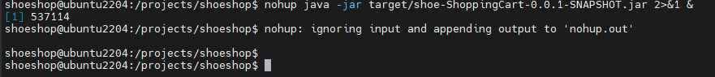

Như vậy, tiến trình đang chạy dưới nền với PID: `537114` và output ra file `nohup.out`:

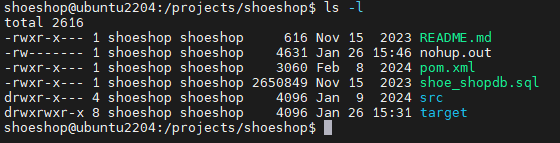

 