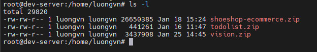
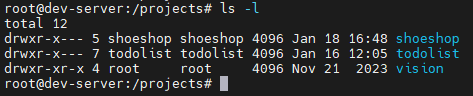
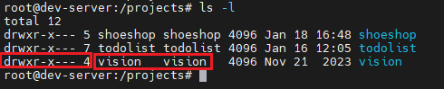
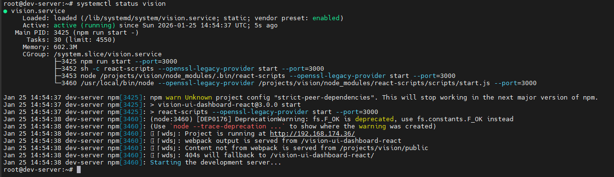

# Triển khai dự án FrontEnd - react

Ở bài viết trước mình đã chia sẻ cách triển khai dự án FE - vue các bạn có thể tham khảo [tại đây](https://github.com/Bimmie226/spOveD-/blob/main/deploy%20demo%20objects/docs/deploy_FE_project_vue.md)

Trong bài viết này sẽ là ghi chú về cách triển khai 1 dự án FE - react 

## Bản demo của project 

Các bạn có thể tải và xem chi tiết project [tại đây](https://github.com/Bimmie226/spOveD-/blob/main/demo%20objects/vision.zip)

## Thực hiện
Tải dự án lên server



Giải nén bằng `unzip`

```bash
unzip vision.zip
```

Ta di chuyển thư mục `vision` vào `/projects` đã tạo từ bài viết trước đó 



Ta tạo user riêng cho dự án:

```bash
adduser vision
```

Thay đổi chủ sở hữu của `/projects/vision` thành `vision`

```bash
chown -R vision:vision /projects/vision/
```

Thay đổi quyền truy cập của những user khác:

```bash
chmod -R 750 /projects/vision/
```



Tiếp theo ta sẽ cài đặt các gói dependencies:

```bash
npm install
```

Trong bài viết này mình sẽ triển khai dự án bằng cách tạo 1 service trên hệ thống. Các bạn cũng có tự research và thể triển khai bằng webserver như bài viết trước về dự án FE vue của mình

Táo file service: `vision.service`

```bash
sudo vi /lib/systemd/system/vision.service
```

Có nội dung như sau:

```bash
[Service]
Type=simple
User=vision
Restart=on-failure
WorkingDirectory=/projects/vision/
ExecStart=npm run start -- --port=3000
```

- `[Service]`: Khai báo phần service runtime của systemd. Nói cho systemd biết chạy cái gì, chạy thế nào
- `Type=simple`: systemd coi process chạy ở foreground. Service được xem là started ngay khi process được spawn
- `User=vision`: Service chạy với user `vision`
- `Restart=on-failure`: Khi mà service down thì sẽ tự restart lại
- `WorkingDirectory=/projects/vision/`: thư mục làm việc
- `ExecStart=npm run start -- --port=3000`: 
  - Lệnh systemd thực sự chạy: `npm run start -- --port=3000`
  - `npm run start`
  - `--` -> phân cách
  - `--port=3000` -> truyền vào script `start`
  - Script `start` trong `package.json` sẽ nhận được `--port=3000`

Khởi động service vision:

```bash
systemctl deamon-reload
systemctl restart vision
```

Kiểm tra lại:

```bash
systemctl status vision
```



