# Triển khai dự án FrontEnd - vue

## Bản demo của project 

Các bạn có thể tải và xem chi tiết project [tại đây](https://github.com/Bimmie226/spOveD-/blob/main/demo%20objects/todolist.zip)

## Thực hiện

Tải dự án lên server:

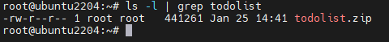

Giải nén prj bằng `unzip`

```bash
unzip todolist.zip
```

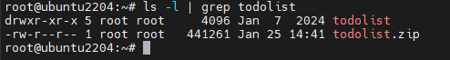

Ta tạo thư mục `/projects` để lưu các dự án:

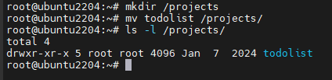

Ta tạo user riêng cho dự án:

```bash
adduser todolist
```

Thay đổi chủ sở hữu của `/projects/todolist` thành `todolist`

```bash
chown -R todolist:todolist /projects/todolist/
```

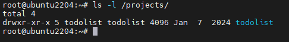

Thay đổi quyền truy cập của những user khác:

```bash
chmod -R 750 /projects/todolist/
```

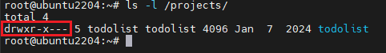

Như ta đã biết để triển khai dự án cần 2 bước chính là: `build` và `run`. Ta có thể research cách build dự án `vuejs`. Ở đây mình tìm được tài liệu và bạn có thể tham khảo [tại đây](https://vuejs.org/guide/quick-start)


Cài đặt `nodejs` và `npm`:

```bash
apt update
apt install nodejs
apt install npm
```

**Ta cần quan tâm đến file cấu hình của dự án**: 

- `package.json`: 

    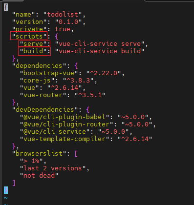

    Ta để ý đến `scripts` có `build` và `serve`. Chính xác là khi ta sử dụng `npm run ...` thì tiền tố đằng sau sẽ nằm trong trường `scripts` này

- `vue.config.js`:

    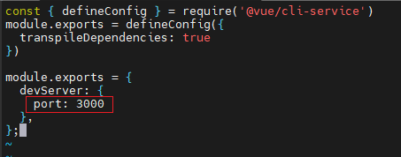

    Ở đây ta có thể thấy được dự án sử dụng port là `3000`

Tiếp theo với tài liệu trên, ta tiền hành cài đặt các cái **dependencies inject:**

```bash
npm install
```

Tiếp theo ta chạy câu lệnh sau để build dự án:

```bash
npm run build
```

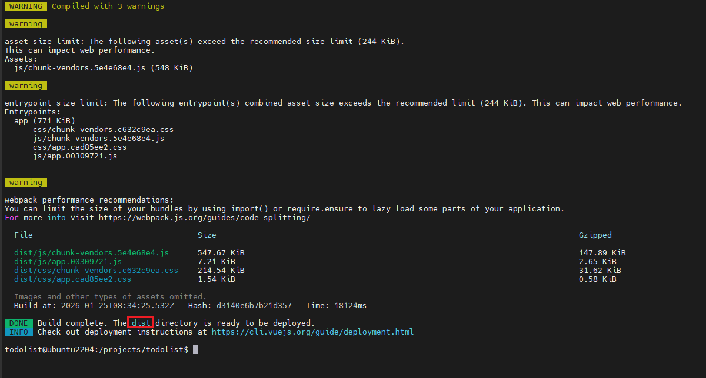

Mỗi một dự án khi build ra thì nó sẽ build ra file hoặc thư mục nào đó. Ta sẽ tìm cách để chạy được file hoặc thư mục đó. Ở đây là thư mục `dist`

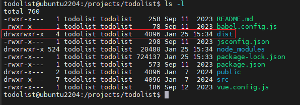

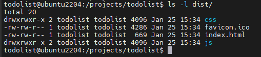

**Ta sẽ có 3 cách để chạy dự án FrontEnd thông dụng**: 

- Web server
- Chạy bằng Service
- Chạy bằng PM2

Với dự án này, ta còn 1 cách nữa đó chính là `npm run serve` nằm trong `package.json`

Ta sẽ chạy dự án bằng cách này: 

```bash
npm run serve
```

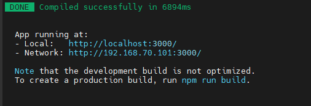

Ta sẽ truy cập `192.168.70.101:3000` trên browser. Lưu ý hãy mở port 3000 trên server nếu dùng tưởng lửa

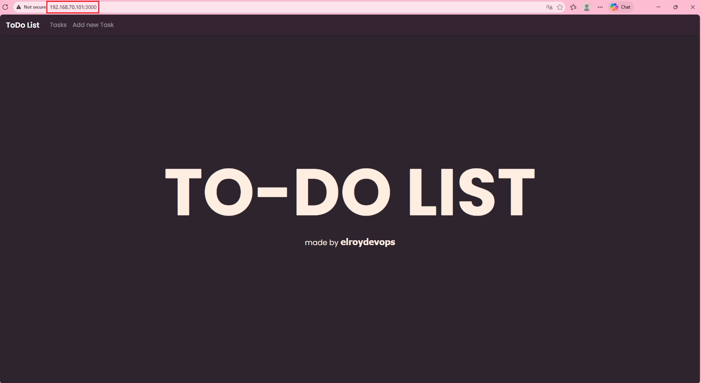


Với cách chạy dự án này bạn đang chạy dự án trên nền nên khi kết thúc tiến trình nền này thì sẽ không thể truy cập được do vậy cách làm này là chưa thực sự tối ưu!

Mình sẽ chạy dự án bằng cách khác, đó chính là sử dụng 1 web server (Apache)

Bạn có thể tham khảo cách cài đặt Apache [tại đây](https://github.com/Bimmie226/system-intership/tree/main/LuongVN/WEBSERVER/Apache)

Trước tiên, ta sẽ tạo 1 virtual host cho `todolist`:

```bash
vi /etc/apache2/site-available/todolist.conf
```

Có nội dung như sau:

```apache
<VirtualHost *:80>
    ServerName todolist.com
    ServerAlias www.todolist.com

    DocumentRoot /projects/todolist/dist/

    <Directory /projects/todolist/dist/>
        Options Indexes FollowSymLinks
        AllowOverride All
        Require all granted
    </Directory>

    ErrorLog ${APACHE_LOG_DIR}/todolist.com-error.log
    CustomLog ${APACHE_LOG_DIR}/todolist.com-access.log combined
</VirtualHost>
```

Kích hoạt website bằng lệnh sau:

```bash
a2ensite todolist.conf
```

Khởi động lại Apache:

```bash
systemctl restart apache2
```

Tiếp theo, ta sửa file host trên máy Windows:

```bash
192.168.70.101 todolist.com
```

Truy cập trên trình duyệt bằng: `http://todolist.com`

Tuy nhiên, ở đây ta sẽ gặp lỗi như sau:

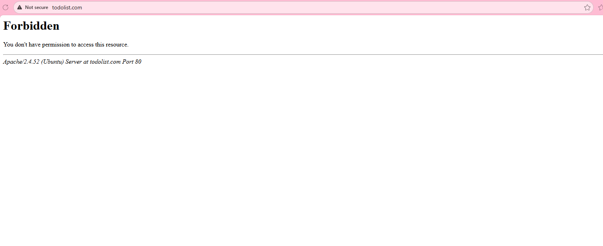

Lý do là `/projects/todolist/` không cho các user khác truy cập vào thư mục này. Mà user mình đang dùng để truy cập là user của Apache!

Ta có thể xem user này bằng cách sau:

```bash
vi /etc/apache2/envvars
```

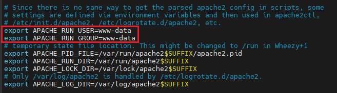

Ta có thể thấy được user apache là `www-data`. Vậy để dự án chạy được trên apache thì user của apache tối thiểu phải nằm trong group `todolist`

```bash
usermod -aG todolist www-data
```

Sau đó khởi động lại Apache:

```bash
systemctl restart apache2
```

Ta truy cập lại trên browser:

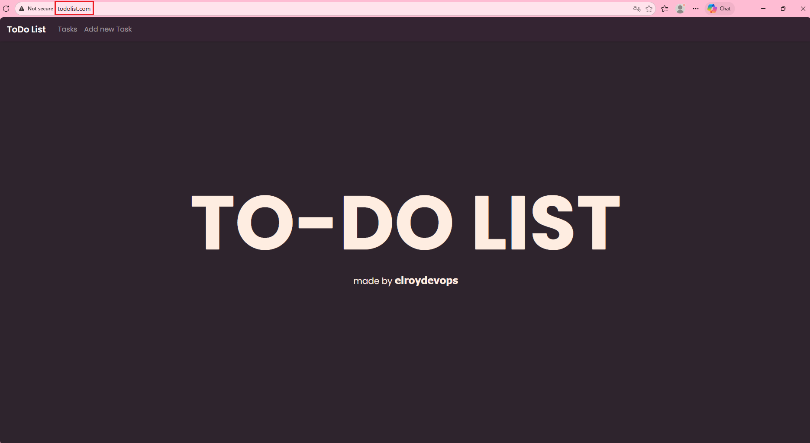

Như vậy, ta đã có thể deploy và truy cập thành công!

